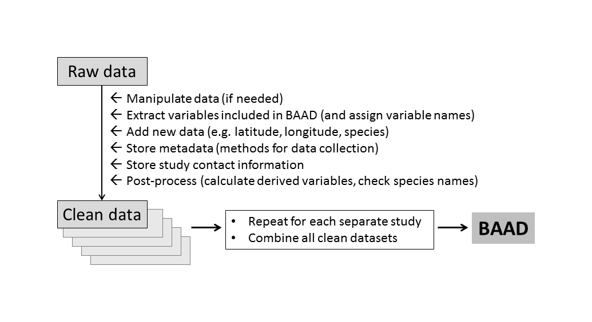

# Errors in the BAAD

If you notice a possible error in the BAAD, please [post an issue here](https://github.com/dfalster/baad/issues), describing the error and possible fix in detail.

# Contributing new data to the BAAD

If you would like to contribute data, the requirements are:

1. You collected biomass or size data for multiple individuals within a species
2. You collected either total leaf area or at least one biomass measure
3. Your biomass measurements (where present) were from direct harvests (not from allometry)
4. That you make it is as easy as possible for us to incorporate your data


**Figure 1** Workflow of BAAD. Data from each study is processed in the same way, resulting in a single dataset ('BAAD') with a common format.


## Preparing data

To contribute, please follow the steps below. It is important that all steps are followed so that the automated workflow (Figure 1) proceeds without problems.

1) Create a folder with name corresponding to the paper or study of the dataset, e.g. `Falster2014` (do not include `etal` or similar).
2) Prepare need the following files:
	- `data.csv`: a table of data in comma-separated values format, with data for each individual plant on a single row
	- `dataImportOptions.csv`: minor details about the file `data.csv`
	- `dataManipulate.R`: a custom R function to manipulate data, if needed
	- `dataMatchColumns.csv`: a table giving units of columns in `data.csv` and suitable columns onto a variable in the BAAD.
	- `dataNew.csv`: any data you wish to add, not already in `data.csv`, e.g. site name, location, vegetation type.
	- `studyContact.csv`: contact details of data contributor(s). Please keep the number of contributors to one or two.
	- `studyMetadata.csv`: description of the methods used to collect the data.
	- `studyRef.bib`: reference for the study, in [bibtex format](http://en.wikipedia.org/wiki/BibTeX#Examples).

See examples from some of the other [datasets within the BAAD](https://github.com/dfalster/baad/tree/master/data). It may help to download one of these and use it as a template for your own files. 


## Adding data to BAAD

### Send us a pull request

By far our preferred way of contributing is for you to fork the database in github, add your dataset then send us a [pull request](https://help.github.com/articles/using-pull-requests/). If this is not possible, you could email the relevant files (see above) to [Daniel Falster](http://web.science.mq.edu.au/directory/listing/person.htm?id=dfalster) or [Remko Duursma](http://pubapps.uws.edu.au/teldir/personprocess.php?9764).

### Adding your study

Once you have prepared your data files, add the relevant folder into the `data` directory. You can then rebuild the dataset, including your dataset.

To do so you will need to rerun the `bootstrap.R` script, which will update the `maker_data.yml` and `maker_reports.yml` files with appropriate rules for the new dataset (similarly if you remove datasets, do the same). (At this stage, [maker](https://github.com/richfitz/maker) offers no looping constructs (on purpose) so for now at least we generate the makerfile using [whisker](https://github.com/edwindj/whisker).)

### Dealing with line endings

**Windows users**

Windows users must make sure that git is configured to commit with Unix-style line endings. This maintains the integrity of files on a Windows machine, while making sure the line-endings in the repository can be used by Mac (Unix) and Windows users alike.

When installing git-scm, make sure the setting

    Checkout Windows-style, commit unix-style line endings

is checked (the default).

**Using Excel on Macs**

We have had problems with Excel on OS X [which uses old line endings](http://developmentality.wordpress.com/2010/12/06/excel-2008-for-macs-csv-bug/), which tend to obscure `diff`s.  To avoid this problem, please set up a git hook that checks for line endings by running (in the project root directory)

```
ln -s ../../scripts/check_line_endings.sh .git/hooks/pre-commit
```

This will check that all files have unix endings once files have been staged (so after git's `crlf` treatment).  You can run it manually to check by running

```
./scripts/check_line_endings.sh
```

which looks at staged files only, or

```
./scripts/check_line_endings.sh csv
```

which looks at *all* csv files in the project, including uncommitted, unstaged, ignored files, etc.

To *fix* line endings, run

```
./scripts/fix-eol.sh path/to/file.csv
```
To fix *all* files in the project, run

```
./scripts/fix-eol-all.sh
```

which looks at all csv files, regardless of git status, ending correctness, etc.  It takes a few seconds to run.
