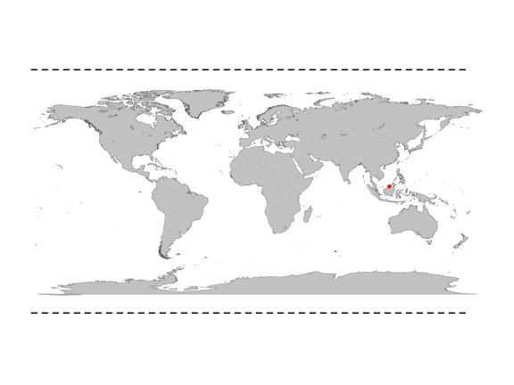
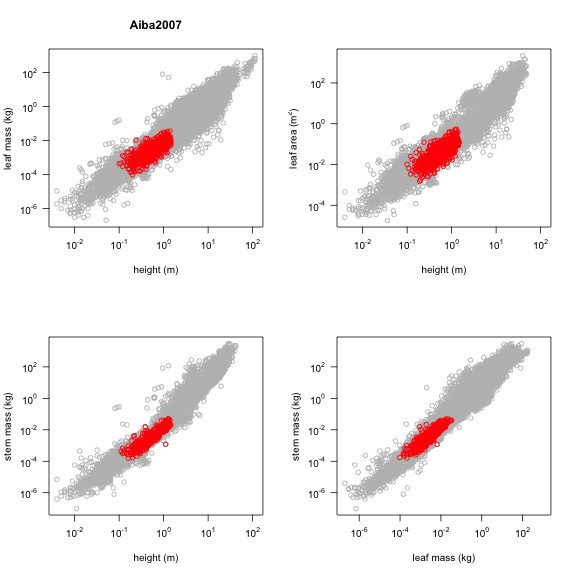

Report for study: Aiba2007
========================================================

Study reference: Aiba2007, Aiba, Masahiro, and Tohru Nakashizuka. Variation in Juvenile Survival and Related Physiological Traits Among Dipterocarp Species Co_existing in a Bornean Forest. Journal of Vegetation Science 18, no. 3 (2007): 379-388. doi:10.1111/j.1654-1103.2007.tb02550.x.

Study contact: Masahiro Aiba.

Contact email: mshiro5@gmail.com.

Contact address: Center for Ecological Research, Kyoto University, Hirano, Otsu 520-2113, Japan.


Data description
-----------------------------------

Data for 801 individuals from 1 locations covering 31 species.

The dataset includes 31 species belonging to 1 family(ies), presenting 1 functional type(s), growing in 1 condition(s) within 1 major type(s) of habitat:


Number of records for each variable
-----------------------------------


```
                 counts
a.lf                801
a.cp                801
h.t                 801
h.c                 801
m.lf                801
m.st                539
m.br                546
m.rt                801
d.ba                801
lf.sz               801
growingCondition    801
```


More details
------------------------------------

### Please check if the points on the map match locations and coordinates  

 


### Please analyse if points on country map match locations and coordinates  

 


### Location level - please provide any missing information

```
                                       Location  MAP MAT Longitude
1 Lambir Hills National Park, Sarawak, Malaysia 2700  26     113.8
  Latitude Vegetation_Type
1     4.03          TropRF
```


### Stand level - please provide any missing information

```
                                       Location Grouping Growing_condition
1 Lambir Hills National Park, Sarawak, Malaysia     ????                FW
  Status
1   ????
```


### Species level - please provide any missing information

```
                      species family pft
1                Shorea acuta   ????  EA
2   Dipterocarpus acutangulus   ????  EA
3                Shorea agami   ????  EA
4        Shorea amplexicaulis   ????  EA
5           Shorea andulensis   ????  EA
6      Dryobalanops aromatica   ????  EA
7           Shorea beccariana   ????  EA
8               Shorea biawak   ????  EA
9             Hopea bracteata   ????  EA
10    Dipterocarpus confertus   ????  EA
11              Shorea crassa   ????  EA
12     Dipterocarpus crinitus   ????  EA
13            Shorea curtisii   ????  EA
14         Shorea exelliptica   ????  EA
15       Shorea falciferoides   ????  EA
16  Dipterocarpus geniculatus   ????  EA
17     Dipterocarpus globosus   ????  EA
18    Dryobalanops lanceolata   ????  EA
19                Shorea laxa   ????  EA
20          Shorea macroptera   ????  EA
21            Shorea ochlacea   ????  EA
22              Shorea ovalis   ????  EA
23               Shorea ovata   ????  EA
24 Dipterocarpus pachyphyllus   ????  EA
25 Dipterocarpus palembanicus   ????  EA
26              Shorea pilosa   ????  EA
27        Shorea scrobiculata   ????  EA
28           Shorea smithiana   ????  EA
29         Hopea sphaerocarpa   ????  EA
30    Dipterocarpus stellatus   ????  EA
31     Dipterocarpus tempehes   ????  EA
```


### Method - please provide any missing information/follow template

```
Called from: printMeta(.dat$data)
```

```
                      Topic
1         Sampling strategy
2                 Leaf area
3 Stem cross sectional area
4                    Height
5                Crown area
6                   Biomass
7                    traits
8        Growth environment
9           Other variables
                                                                                  Description
1  Please a brief description of the sampling strategy used in this paper (up to 4 sentences)
2                                                                          Please provide ...
3                                                                          Please provide ...
4                                                                          Please provide ...
5                                                                          Please provide ...
6                                                                          Please provide ...
7                                                                          Please provide ...
8                                                                          Please provide ...
9                                                                          Please provide ...
```


Plot of data
---------------------------------

This is how the study Aiba2007 (red symbols) fits in the entire dataset.

 


  
  
  
